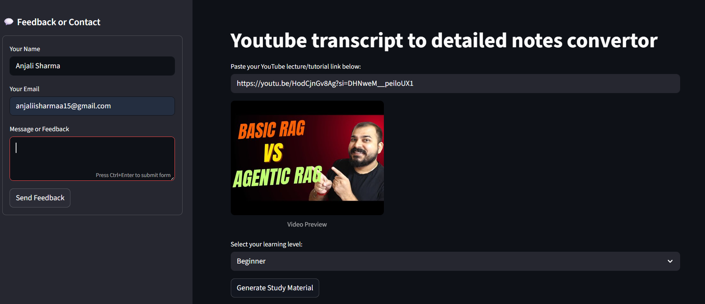
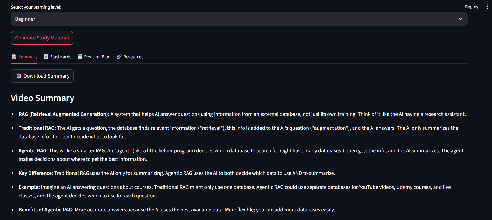
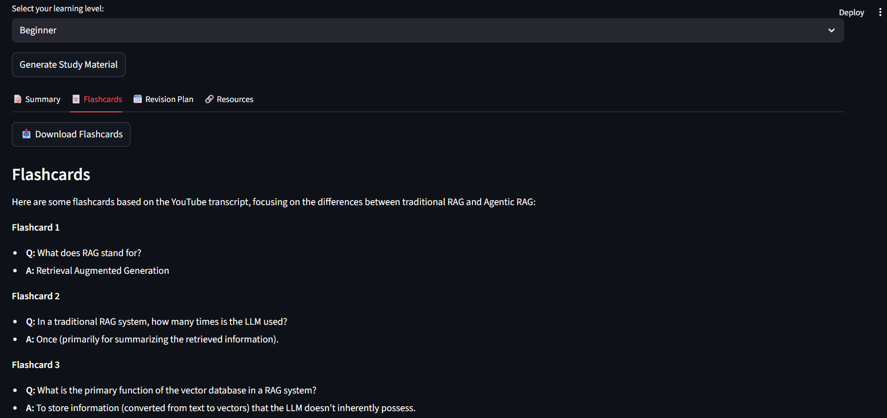
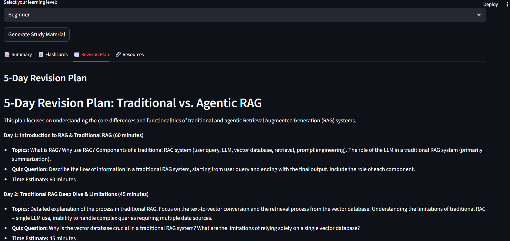
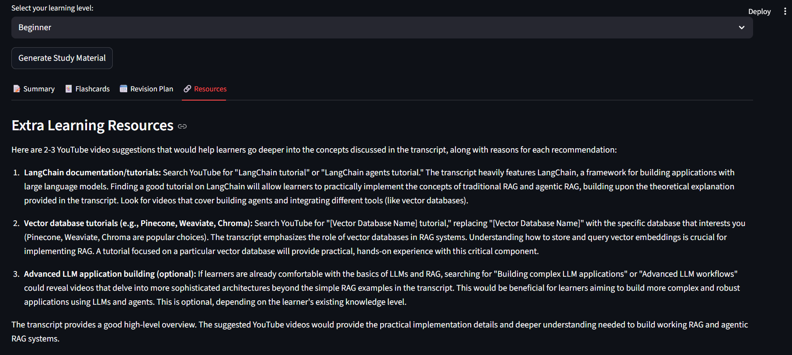
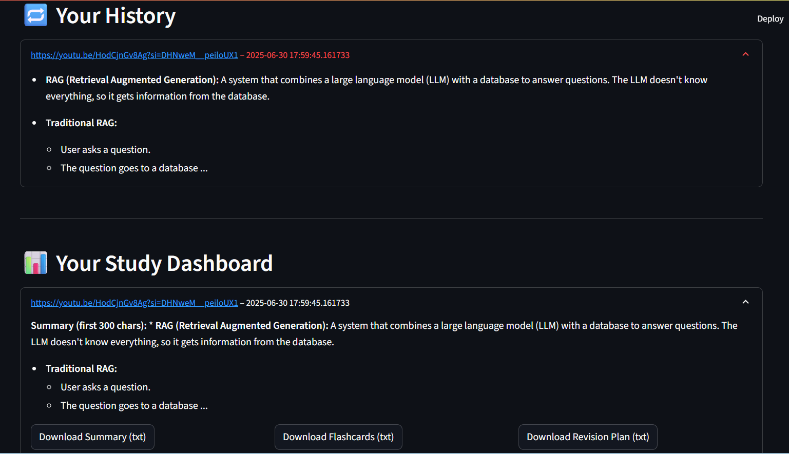

# Learning Help AI

A modern Streamlit web app that converts YouTube lecture/tutorial videos into detailed study materials using Google Gemini AI. Instantly generate summaries, flashcards, revision plans, and extra resources from any YouTube video link!

---

## ✨ Features

- **YouTube Transcript to Notes**: Paste any YouTube link and get a transcript-based summary, flashcards, revision plan, and extra resources.
- **Learning Level Selection**: Choose Beginner, Intermediate, or Advanced for personalized content.
- **Beautiful UI**: Modern dark theme, clear layout, and easy navigation.
- **Personal Dashboard**: View and download all your past study sessions as TXT or PDF.
- **Feedback Sidebar**: Users can send feedback directly from the app.
- **Download Options**: Export summaries, flashcards, and revision plans as TXT or PDF.

---

## 📸 Screenshots

### Main Interface


### Summary Tab


### Flashcards Tab


### Revision Plan Tab


### Resources Tab


### Dashboard & History


---

## 🚀 Getting Started

### 1. Clone the Repository
```bash
git clone https://github.com/yourusername/learning-help-ai.git
cd learning-help-ai
```

### 2. Install Requirements
It is recommended to use a virtual environment:
```bash
python -m venv venv
source venv/bin/activate  # On Windows: venv\Scripts\activate
pip install -r requirements.txt
```

### 3. Set Up Google Gemini API Key
- Create a `.env` file in the project root:
  ```
  GOOGLE_API_KEY=your_gemini_api_key_here
  ```
- [Get your Gemini API key here.](https://ai.google.dev/gemini-api/docs/get-api-key)

### 4. Run the App
```bash
streamlit run app.py
```

The app will open in your browser at `http://localhost:8501`.

---

## 🌐 Live Demo

Check out the deployed app here: [retainia.streamlit.app](https://retainia.streamlit.app/)

---

## 🗂️ Project Structure
```
├── app.py                # Main Streamlit app
├── core.py               # Core logic (YouTube, Gemini, etc.)
├── requirements.txt      # Python dependencies
├── feedback.txt          # Stores user feedback
├── .env                  # Your Gemini API key (not committed)
├── screenshots/          # App screenshots for README
└── ...
```

---

## 📝 Usage
1. Paste a YouTube lecture/tutorial link.
2. Select your learning level.
3. Click **Generate Study Material**.
4. Explore the tabs: Summary, Flashcards, Revision Plan, Resources.
5. Download your notes as TXT or PDF.
6. View your study history and dashboard.
7. Send feedback via the sidebar.

---

## 🤝 Contributing
Pull requests are welcome! For major changes, please open an issue first.

---

## 📄 License
This project is licensed under the MIT License.
